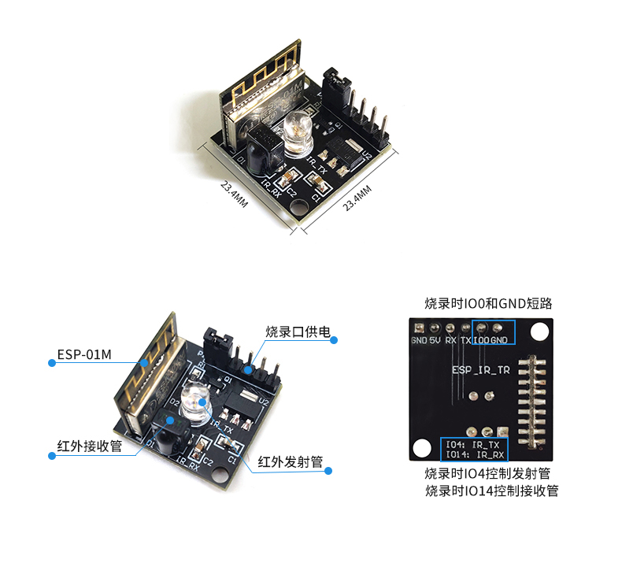

# Home197-TV-System-Status

[](https://esphome.io/)
[](http://www.lctech-inc.com/cpzx/1/486.html)

🎛️ A real-time system status monitoring for Hisense TV



## Usage

```
esphome hisense_tv_ir_remote_controller.yaml run
```

```
esphome hisense_tv_is_on_monitor.yaml run
```
